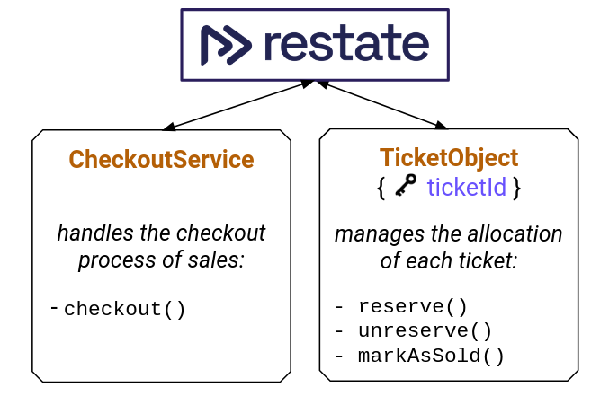

# Hands-on intro: Building resilient Java applications with Restate

This guide will walk you through building a Java application with Restate.
It will cover all the basic concepts and features of Restate that you will need to build your own applications.

Pre-requisites:
- Java 21
- [Install Restate Server and CLI](https://docs.restate.dev/develop/local_dev#running-restate-server--cli-locally)

In this example, we will implement an e-commerce checkout process that let's you buy concert tickets.
The application will make sure every ticket only gets sold once.



Content:
1. Why do we need Restate?
2. How does Restate work?
3. Running your first application
4. Persisting results
5. Resiliency
6. Observability and debugging with Restate CLI
7. Awakeables
8. Service communication
9. Virtual Objects & State
10. Timers & scheduling
11. Sagas
12. Idempotency
13. Summary

## Why do we need Restate?

## How does Restate work?

## Running your first application
[Quickstart](https://docs.restate.dev/get_started/quickstart?sdk=java)

Follow the [quickstart](https://docs.restate.dev/get_started/quickstart?sdk=java) to get your local setup.

A Restate application consists of services that communicate via handlers, and are annotated with `@Service`.
Each handler is a service method annotated with `@Handler` and takes a `RestateContext` as its first argument.

Restate sits in front of your services like a reverse proxy or message broker.
Restate receives incoming requests and routes them to the appropriate handlers.

In our example, we have a `CheckoutService` with a `checkout` method that reserves the ticket for the user and handles the payment.
This will be the first service we will develop:

1. Rename the `Greeter` to `CheckoutService`
2. Rename the `greet` method to `checkout` and let it take a `String ticket` as an argument.

Run the application again and invoke the checkout method.

```shell
curl localhost:8080/CheckoutService/checkout -H 'content-type: application/json' -d '"Rolling_Stones_31122024"'
```

## Persisting results
[SDK Docs](https://docs.restate.dev/develop/java/journaling-results)

You can store the result of a (non-deterministic) operation in the Restate execution log (e.g. HTTP calls, randoms, etc). 
Restate replays the result instead of re-executing the operation on retries.

You can use `ctx.run` to execute an operation and store the result in the execution log.

Let's do the payment by:
1. Using `ctx.run` to generate a unique payment identifier that is stable on retries.
2. Do the payment and use the payment identifier for deduplication. 

```java
  private boolean pay(String paymentId, int amount){
    // call payment provider
    logger.info("Doing the payment for id " + paymentId + " and amount " + amount);
    return true;
  }
```

Have a look at the [p1/checkoutService](src/main/java/my/example/p1/CheckoutService.java).

## Resiliency
[Docs](https://docs.restate.dev/concepts/durable_execution)

Restate retries failed invocations automatically.
On each retry, Restate replays the execution log to restore the state of the service.

Run the [p1/checkoutService](src/main/java/my/example/p1/CheckoutService.java) and see how the retries take place.

## Observability and debugging with Restate CLI
[Docs](https://docs.restate.dev/operate/introspection)

The Restate CLI provides a set of commands to [inspect the state](https://docs.restate.dev/operate/introspection?interface=cli) of your services and invocations.

To list all invocations:
```shell
restate invocations list
```

To have a look at the invocations that are currently in a retry loop, you can execute:
```shell
restate invocations list --status backing-off
```

To describe a specific invocation:

```shell
restate invocations describe <id>
```

Restate exposes a [SQL interface](https://docs.restate.dev/operate/introspection) to query the entire state of the system:

```shell
restate sql "query"
```

Restate also exports OTEL traces to for example Jaeger. Learn more in the [monitoring docs](https://docs.restate.dev/operate/monitoring/tracing). 

## Awakeables 
[SDK Docs](https://docs.restate.dev/develop/java/awakeables)

Awakeables pause an invocation while waiting for another process to complete a task. You can use this pattern to let a handler execute a task somewhere else and retrieve the result. 
This pattern is also known as the callback (task token) pattern.
When the process crashes while waiting for an awakeable, Restate will resume the process and recover the awakeable.

You can resolve an awakeable via its ID, either via HTTP or with SDK from within another service.

Let's turn the synchronous payment into an asynchronous payment and create an awakeable to wait for the async response. 

```shell
  private void payAsync(String paymentId, int amount, String durableFutureId){
    // call payment provider
    logger.info("Doing the payment for id " + paymentId +
            ", amount " + amount +
            " and durableFutureId " + durableFutureId);
  }
```

Have a look at the code in [p2/CheckoutService](src/main/java/my/example/p2/CheckoutService.java).

Re-run the service, send a new checkout request, and resolve the awakeable with:

```shell
curl localhost:8080/restate/awakeables/prom_1PePOqp/resolve
    -H 'content-type: application/json'
    -d 'true'
```

## Service communication
[Docs](https://docs.restate.dev/develop/java/service-communication)

The previous sections mainly talked about Durable Execution, retries, and recovery.

Restate does not only provide resiliency for code execution but also for service communication.

When you define Restate services, Restate generates clients for you to call these services. 
These clients can be used for request-response calls (RPC), one-way calls (message-queue-like), and delayed calls (see later).

Restate makes sure that the request is delivered to the target service, and makes sure the execution runs till completion via Durable Execution.

Let's implement a `TicketService` that provides a method to reserve a ticket.
We will call this service from the `CheckoutService` to reserve the ticket before handling the payment.

Have a look at [p3/CheckoutService](src/main/java/my/example/p3/CheckoutService.java) 
and [p3/TicketService](src/main/java/my/example/p3/TicketService.java).

## Virtual Objects & State
[Concept of Virtual Objects](https://docs.restate.dev/concepts/services)
[SDK Docs on K/V state](https://docs.restate.dev/develop/java/state)

Restate has an embedded K/V store that can be used to store application state for your handlers.

Services with access to K/V state are called Virtual Objects. 

Their characteristics are:
- You address a Virtual Object entity by a key (its unique identifier)
- K/V state is isolated per entity
- A single entity can only have a single handler running at a time
- K/V state lives forever
- Restate attaches the K/V state to the request when invoking a handler

Let's turn the TicketService into a Virtual Object, keyed by ticket ID.
We will store the ticket state in the K/V store and use it to implement a durable state machine that tracks the status of the ticket.

Have a look at [p4/TicketService](src/main/java/my/example/p4/TicketService.java) and [p4/CheckoutService](src/main/java/my/example/p4/CheckoutService.java).

You can use the CLI to inspect the K/V state of Virtual Objects:

```shell
restate kv get <SERVICE> <KEY>
```

## Timers & scheduling
[Docs](https://docs.restate.dev/develop/java/durable-timers)

Restate's Durable Execution mechanism gives your code workflow-like semantics. 
Similar to workflow orchestrators, Restate also includes timer and scheduling functionality.

You can sleep, schedule a call for later or set a timeout for an operation.
Restate will track the timers, and make sure they are executed at the right time.
If the service crashes, Restate will resume the execution on another instance once the timer has expired. 
The execution will be fast-forwarded to the point where the timer was set. 

The delayed call functionality let's you schedule an execution for a later time.
This can be used as a delayed task queue, for work parallelization or for cron jobs.

In the example, we will wait for the payment callback with a timeout of 10 minutes. 
If the payment does not come in time, we will revert the reservation. 
We will do that with sagas, have a look at the next section.

## Sagas
[Blog post](https://restate.dev/blog/graceful-cancellations-how-to-keep-your-application-and-workflow-state-consistent/)

Do we still need sagas if we have Durable Execution?
Not necessarily, meaning that Restate will always try to drive the execution forward, to completion.

But there might be some cases in which your business logic demands to end processing and revert operations.
In this case, you can let your code throw an exception, catch it, do compensations, and throw a `TerminalException`.
A `TerminalException` is the only type of exception that will not be retried by Restate.

Let's implement a saga for the checkout process. 
When the payment fails or times out, we want to abort the payment and revert the ticket reservation.
Throughout the code we will compose a list of compensation operations that need to be executed when a timeout or terminal exception occurs.
In our catch block, we then run these compensations in reversed order. 

Have a look at [p5/CheckoutService](src/main/java/my/example/p5/CheckoutService.java).

## Idempotency
[Docs](https://docs.restate.dev/invoke/http#invoke-a-handler-idempotently)

Restate guarantees that calls between Restate services are done exactly-once. 
To also get this deduplication guarantee for incoming requests, you can use idempotency keys.

An idempotency key is a unique identifier for a request that is sent by the client.
The client can send the same request multiple times, but Restate will only process it once.

You can add an idempotency key to a request by adding a header:

```shell
curl localhost:8080/CheckoutService/checkout -H 'content-type: application/json' \
    -H 'idempotency-key: ad5472esg4dsg525dssdfa5loi'  \
    -d '"seat2C"'
```


# Summary what did we do and Q&A

| What we implemented | What we didn't implement, as Restate handles it for us |
|-------|-------|
| ✅ Durably executed functions | ❌ Manual retry logic and partial progress recovery |
| ✅ Reliable RPC, messaging, webhooks | ❌ Deploy MQ, retry logic, timeouts, race conditions, etc. |
| ✅ Durable timers and scheduling | ❌ Workflow orchestrators, schedulers, or cron jobs |
| ✅ Idempotency | ❌ Deduplication logic |
| ✅ Consistent K/V state | ❌ K/V state store, concurrency guards, inconsistent state, dual write problems |
